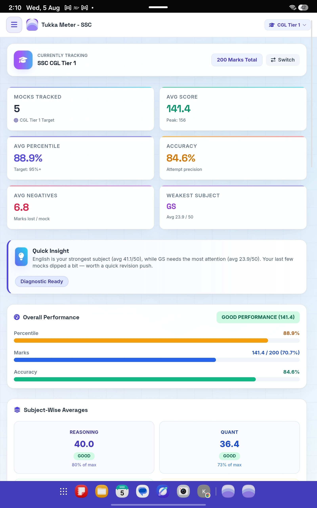
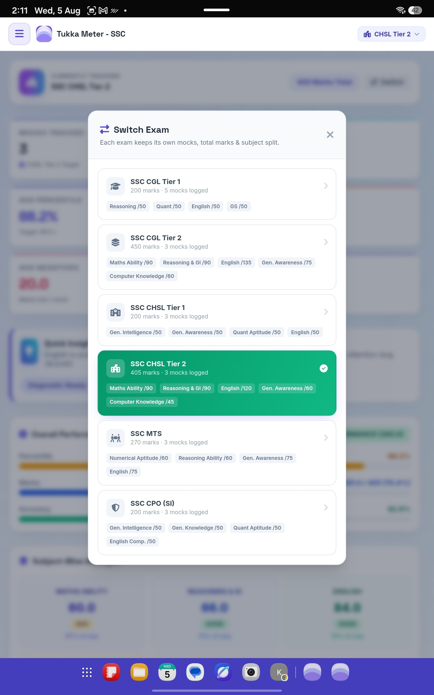
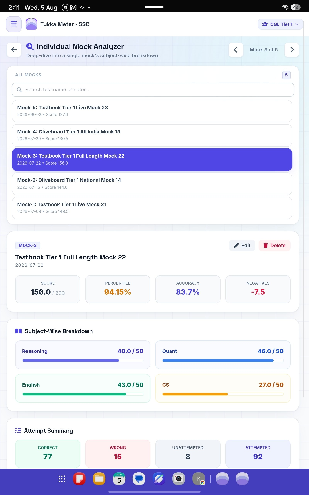

# 🎯 Tukka Meter - SSC

A simple tracker to log your SSC mock test performance and analyze your mistakes — see where you're guessing right, where you're going wrong, and improve with clarity.

🔒 **Your data stays on your own device.** Nothing is uploaded, tracked, or shared with anyone. No login, no account, no data collection.

📱 **Install as an app (Android):** Download the APK from the [Releases](../../releases) section.

⚠️ **Note:** the app comes preloaded with sample/demo data so you can see how it works. Please delete this sample data first, then start adding your own mocks.
- The only permission the app may ever ask for is to import a JSON file, if you choose to use that feature — completely optional, never required

📱 **Install as an app (Android):** Download the APK from the [Releases](../../releases) section.

⚠️ **Note on installing the APK:** since this isn't from the Google Play Store, Android will show a warning like *"Install blocked"* or *"Unknown app installed for your security"* when you first try to install it. This is normal for any app shared outside the Play Store — just tap **"Install anyway"** or enable **"Allow from this source"** when prompted. The app itself is safe; this warning appears for any APK not downloaded from Play Store.

### 📱 Screenshots

## What it does
- Log your SSC mock test scores and track performance over time
- Error/mistake analytics — see patterns in where you're going wrong
- Works fully offline once opened — no internet needed for daily use

## Why it's safe to use
- No sign-up, no account, no personal information asked
- Your data lives only in your own browser/phone
- - The only time this app connects to the internet is if you choose to sync with Google Sheets — entirely optional, off by default, and never automatic

## How to use
1. **First, clear the sample/demo data that comes pre-loaded**
2. Add your own mock tests and track your performance

---
Built by an aspirant, for aspirants. Free to use — share it with anyone preparing for SSC exams.
